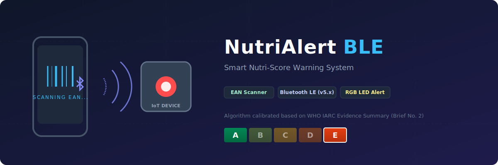

# 🥗 NutriAlert BLE

<p align="center">
  
</p>

<p align="center">
  <a href="https://www.iarc.who.int/wp-content/uploads/2021/09/IARC_Evidence_Summary_Brief_2.pdf">
    
  </a>
  
  
  
</p>

---

## 📖 Overview

**NutriAlert BLE** bridges the gap between digital nutritional data and instant, real-world behavioral feedback. By scanning a consumer food product's EAN barcode with a smartphone app, the system processes its numerical nutritional profiling index and transmits a light data payload via **Bluetooth Low Energy (BLE)** to a dedicated hardware module.

The physical device instantly illuminates an onboard **RGB LED array** matching the standard 5-color Nutri-Score classification—giving consumers an undeniable, ambient visual warning *before* they make a dietary choice.

---

## 🚀 Key Features

* **Instant EAN Scanning:** High-performance, low-latency barcode parsing through the mobile companion application.
* **Low-Overhead BLE Communication:** Optimized Bluetooth Low Energy GATT architecture ensures rapid transmission between mobile peripherals and the hardware node.
* **Chroma-Status Alerts:** The physical IoT module cycles through the verified five-tier Nutri-Score spectrum:
  * 🟩 **A** (Dark Green) & **B** (Light Green) – Optimal choices.
  * 🟨 **C** (Yellow) – Moderate profile.
  * 🟧 **D** (Orange) & 🟥 **E** (Red) – High-risk alert.
* **Robust Local Cache:** Speeds up response times for frequently scanned items, limiting unnecessary API latency and keeping the hardware responsive.

---
## 🔄 System Architecture & Data Flow

```text
   [ Food Product ] 
          │ 
          │ (Reads EAN Barcode)
          ▼
    📱 [ Mobile App ] ──────────────┐
          │                         │ (Queries database &
          │ (Calculates Score)      │  validates metrics)
          ▼                         ▼
   [ Nutri-Score Index ]      [ BLE Data Packet ]
                                    │
                                    │ (Wireless Broadcast)
                                    ▼
                             🎛️ [ IoT Node ]
                                    │
                                    ▼
                       🚨 [ RGB LED Visual Glow ]
                           (A 🟩 ──► C 🟨 ──► E 🟥)
```
1. **Capture:** The smartphone camera captures the product's **EAN Barcode**.
2. **Compute:** The mobile application processes the code, matches it against an indexed nutritional database, and extracts the nutrient profiling index.
3. **Transmit:** The target letter score (A, B, C, D, or E) is compressed into a light characteristic data packet and beamed across **BLE**.
4. **Indicate:** The peripheral microcontroller intercepts the character state and adjusts the pulse-width modulation (PWM) pins to project the matching ambient LED color array.

---

## 🔌 Hardware Configuration

The system firmware is designed to be highly portable across various low-power microcontrollers supporting BLE.

### Components
* **Microcontroller:** ESP32-C3.
* **Display Indicators:** Diffused WS2812B (NeoPixel) RGB LED.
* **Power Management:** Optimized for lithium-polymer (LiPo) cells utilizing hardware deep-sleep cycles during Bluetooth idling states.

### BLE GATT Profile
* **Custom Service UUID:** `4fafc201-1fb5-459e-8fcc-c5c9c331914b`
* **Nutri-Score Characteristic UUID:** `beb5483e-36e1-4688-b7f5-ea07361b26a8` (Write-Only, expects integer values `1` to `5` corresponding to grades `A` through `E`).

---

## 🔬 Scientific Foundation

The underlying grading logic integrated into this repository's software architecture adheres strictly to the public health insights published by the **World Health Organization's International Agency for Research on Cancer (IARC)**.

> **According to IARC Evidence Summary Brief No. 2:**
> *"The Nutri-Score is a science-backed tool designed to guide consumers toward healthier food choices in order to reduce the risk of non-communicable diseases, such as obesity, cardiovascular conditions, and cancer."*

The codebase utilizes these precise classification standards to calculate nutrient density ratios, weighing unfavorable elements (sugars, saturated fatty acids, sodium, and total energy value) against favorable components (proteins, fiber, fruits, vegetables, pulses, and nuts). 

📄 [Access the full WHO IARC Evidence Summary PDF](https://www.iarc.who.int/wp-content/uploads/2021/09/IARC_Evidence_Summary_Brief_2.pdf)

---
